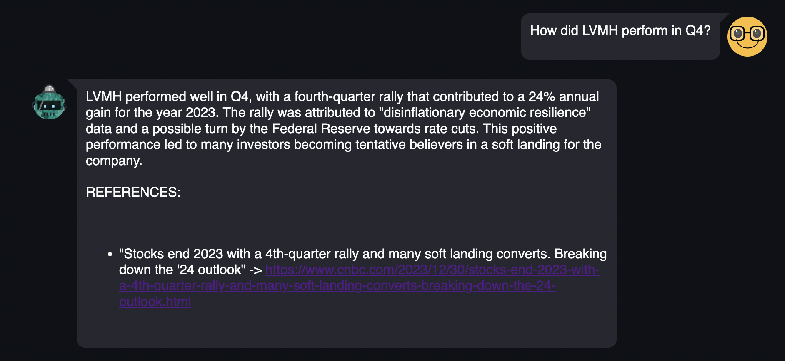
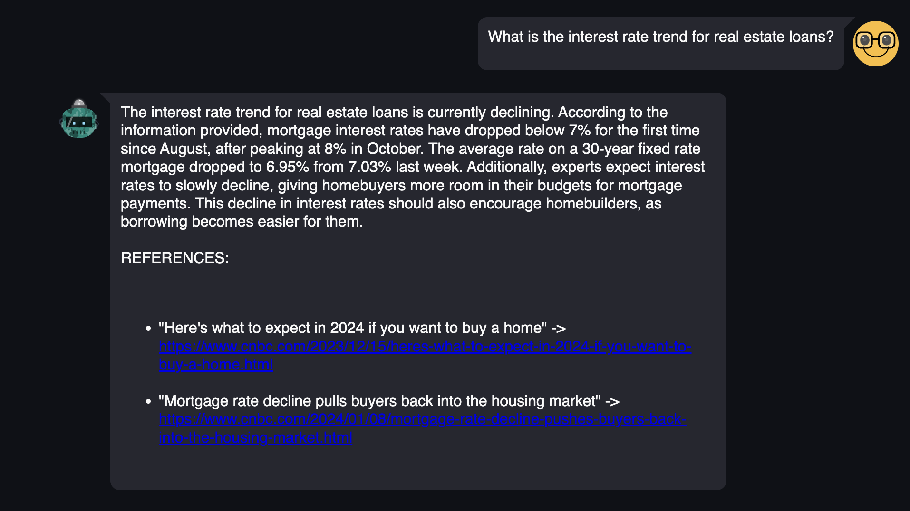
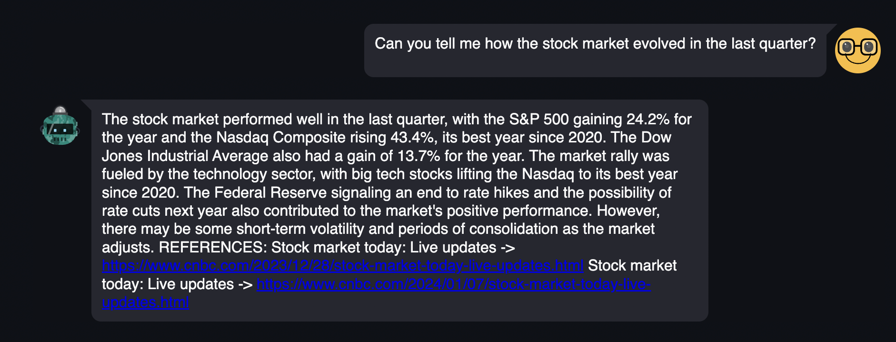

# Retrieval Augmented Financial Analyst (Financial GPT)
Here is my solution to build a financial analyst assistant.

# Commands

### Pull my app from the Docker Hub
The easiest way to lauch my web app is to use Docker. (Assuming you have Docker Engine installed and a Docker Id to login).
In a command line:

- `docker login -u <username>`
- `docker pull aymenkallala/mithril_technical_assignment:latest`
- `docker run -p 8501:8501 docker.io/aymenkallala/mithril_technical_assignment:latest`
- Now open the 'External URL' in your browser. Enjoy the bot.

### Running the app locally from this repository
- clone this repository
- Create a new Python environment provided with pip
- run `pip install -r requirements.txt`
- run `streamlit run src/app.py`
- Now open the 'External URL' in your browser. Enjoy the bot.

**If none of the solutions above have worked for whatever reasons, I keep a low-price VM running and hosting the app at this address** : [Link to my running app](http://34.27.199.18:8501)

# Tip Notes (Important)

1. Once in the app, *you will have to provide your OPENAI API KEY* to query the bot, as I built my agent with the `gpt-3.5-turbo` model by default.  You can obtain an API key by logging into your OpenAI account and [creating a new API key](https://platform.openai.com/account/api-keys).
2. This bot is a Q&A bot, which means that it does not keep track of the conversation, but answers your queries one by one. Remember to "Clear the conversation" every once in a while to assure a better inference time.
3. You will be able to pick your source of information, the choice is between CNBC and Investopedia. The former give the agent a broder access and the ability to answer more general questions like _How was Apple performing lately?_ or _How can global markets be impacted by a war involving Iran and the US?_. Whereas the latter gives more specific financial details, and access to thorough analysis that can help answer precise questions like _What is happening to the US regional banks?_.

# Implementation Details

The bot is composed of two building blocks that work sequentially:

### A Scraper

That takes your query as input and searches the web to find 5 relevant articles. In practice, it does not browse the whole web but only 2 websites (you can pick which one). Either [Investopedia](https://www.investopedia.com/) (a financial-only website) That can provide accurate answers on very specific questions, or [CNBC](https://www.cnbc.com/) that has a broader range of informations (it does not have to be financial, you can also find more information about socio-political phenomenons).

To build the scraper, I used `duckducksearchgo` to browse the web and `BeautifulSoup` and `scrapy` to scrape the content of relevant articles.

*NB*: I want to stress that I first tried to use `Selenium` and [archive](https://www.archive.is/) to scrape articles from any newspaper (even the one with paywalls) but got blocked by a google recaptcha that I could not manage to break. Hence I went for another solution that appeared to be lighter and faster and decided to focus on open websites.

### A RAG Pipeline ([Paper](https://arxiv.org/pdf/2005.11401.pdf))

That retrieves the most relevant information from the scraped articles relatively to the query, and takes it as context to summarize. One of the main features I implemented (prompt engineering) is that the bot is *citing its sources*. Hence, it becomes possible to assess the veracity of the provided answer. The pipeline is using OpenAI LLMS (`embedding-v3` and `gpt-3.5-turbo`) to process the retrieval and generation. Hence, it can be subject to hallucinations. Making it citing the sources can help us to detect a hallucination.

Sometimes not enough information is found on CNBC, which can cause an hallucination. For instance, the bot claims here that LVMH performed well in the last Q4 and points us to an article. However, no mention of LVMH is done in this one... **It is important to verify coherence of the response by checking the sources**.

I used [llama_index]( https://docs.llamaindex.ai/en/stable/) to build the RAG pipeline, specifically picked a "tree_summarizer" form query engine to generate the answer. All the hyperparameters are stored in an editable `config.yml` file.

## Examples of Generated Answers

